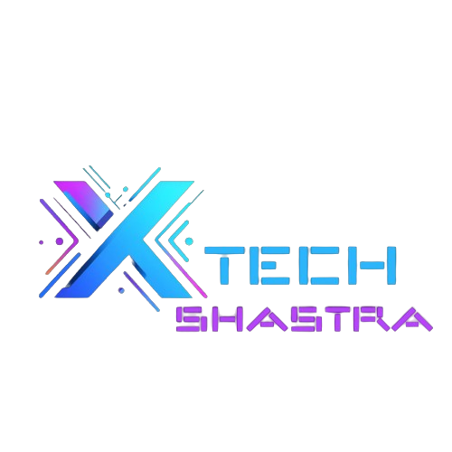

<p align="center">
  
</p>

<h1 align="center">TECHSHASTRA PLATFORM</h1>

<p align="center">
  <strong>Innovate · Create · Dominate</strong><br/>
  The official digital platform and central operating system of <strong>TechShastra</strong> — the Technical & Entrepreneurship Club of Veer Madho Singh Bhandari Uttarakhand Technical University (VMSB UTU), Dehradun.
</p>

<p align="center">
  <a href="https://techclub-gamma.vercel.app"></a>
  
  
  
  
  
  
</p>

---

## ⚡ Overview

**TECHSHASTRA** is a full-stack club portal designed to connect developers, student innovators, researchers, and mentors across the university. The platform combines a public-facing showcase, an interactive live-code execution sandbox, a student membership & profile ecosystem, event and hackathon management, bulk certificate distribution, and an administrative telemetry dashboard.

### 🌟 Key Highlights

- 🔐 **Multi-User Member Authentication**: Secure signup, login, and profile management with Bcrypt password hashing and HMAC-SHA256 JWT sessions.
- 💻 **Interactive Project Sandboxes**: Live in-browser execution of member projects via StackBlitz WebContainers (JavaScript/React) and Pyodide (Python WebAssembly), with responsive non-clipping viewport modals.
- 🛡️ **Admin Command Center & Telemetry**: Real-time tracking of page visits, project views, event registrations, member management (role elevation and ban/unban toggles), and system metrics.
- ⚡ **Dual-Mode Resilient Architecture**: Operates with a native Go REST API + SQLite database when connected to a cloud backend, while seamlessly falling back to a persistent client-side store when hosted as a static Single Page Application on Vercel.
- 📜 **Certificate Generation & Distribution**: Built-in canvas engine with Excel recipient upload, drag-and-drop badge formatting, and bulk email distribution via EmailJS.
- 🎨 **Modern Cyber-Glass Aesthetics**: Dark/Light mode, framer-motion animations, reactive border glow effects, and responsive navigation.

---

## 🗂️ Platform Features & Routes

| Section | Route | Description |
|---|---|---|
| **Home** | `/` | Club mission, leadership, domains, dignitary messages, spotlight, and quick contact. |
| **Member Sign Up** | `/signup` | Student registration with roll number, skills, GitHub, LinkedIn, and bio. |
| **Member Sign In** | `/login` | Secure member login with session persistence and auto-redirect. |
| **User Dashboard** | `/dashboard` | Member profile editor, personal project upload form, and event registration status. |
| **Projects Showcase** | `/projects` | Filterable project directory with live code sandbox and GitHub links. |
| **Project Live Sandbox** | `/projects/live/:id` | Fullscreen live interactive sandbox runner for deployable web/python code. |
| **Events & Hackathons** | `/events` | Upcoming hackathons, workshops, and past event archives with one-click RSVP. |
| **Event Details** | `/events/:id` | Event schedule, speaker profiles, venue, and registration tracker. |
| **Admin Hub** | `/admin` | Telemetry analytics, user activity feed, member roles, and content management. |
| **Super Admin Auth** | `/auth` | Emergency offline credential login for faculty coordinators. |
| **Team & Faculty** | `/members` | Core team directory, alumni network, and dignitary profiles. |
| **Gallery & Media** | `/gallery` | Masonry photo gallery showcasing workshops and hackathons. |
| **Certificates** | `/admin` (Tab) | Certificate template builder with Excel roster import and bulk emailing. |

---

## 🏗️ Architecture & Technology Stack

```
TechShastra Full-Stack Ecosystem
│
├── Frontend (React + TypeScript + Vite)
│   ├── UI Layer: Tailwind CSS + shadcn/ui + Framer Motion
│   ├── State & Auth: React Context (authContext.tsx) + localAuth fallback
│   ├── Sandboxes: StackBlitz SDK (@stackblitz/sdk) + Pyodide WebAssembly
│   └── Telemetry: activityTracker.ts (batched background queue)
│
└── Backend (Go REST API in server/)
    ├── Router & Middleware: net/http + CORS + JWT Auth + Activity Logger
    ├── Database: SQLite (server/data/techshastra.db)
    ├── Security: Bcrypt (golang.org/x/crypto/bcrypt) + HMAC-SHA256 JWT
    └── Handlers: Auth, Projects, Events, Telemetry, and Admin Management
```

### Frontend
- **Framework**: React 18 with TypeScript 5
- **Build Tool**: Vite 5 with `@vitejs/plugin-react-swc`
- **Styling**: Tailwind CSS 3, Radix UI primitives, Lucide React icons
- **Animations**: Framer Motion, Lenis smooth scrolling, BorderGlow shaders
- **Code Execution**: `@stackblitz/sdk` for Node/React, `pyodide` for Python in WebAssembly

### Backend
- **Language**: Go 1.22+
- **Database**: SQLite3 (`modernc.org/sqlite` — CGO-free pure Go driver)
- **Auth**: Bcrypt password hashing (`golang.org/x/crypto/bcrypt`), JWT tokens (`golang-jwt/jwt/v5`)
- **API Architecture**: Clean REST endpoints with JSON payloads and context-based role verification

---

## 📁 Repository Structure

```
TechShastra/
├── .npmrc                  # NPM scripts configuration for CI/Vercel
├── vercel.json             # SPA routing rewrite rules for Vercel deployment
├── package.json            # Frontend dependencies and unified scripts
├── tsconfig.json           # TypeScript configuration
├── vite.config.ts          # Vite build and proxy settings
│
├── public/                 # Static public assets, favicon, certificates
│
├── src/                    # Frontend React Source
│   ├── assets/             # Logos, dignitary photos, illustrations
│   ├── components/         # Modular components (Navbar, Footer, Hero, UtuSlider, etc.)
│   │   └── ui/             # shadcn/ui components (cards, dialogs, buttons, glow)
│   ├── hooks/              # Custom React hooks (useAuth, useToast, use-mobile)
│   ├── lib/                # Core logic & stores
│   │   ├── api.ts          # Unified Go backend API client with offline fallbacks
│   │   ├── authContext.tsx # Dual-mode authentication provider
│   │   ├── localAuth.ts    # Resilient local storage auth fallback
│   │   ├── activityTracker.ts # Client-side telemetry queue
│   │   ├── projectStore.ts # Project showcase store
│   │   └── studentStore.ts # Student record utilities
│   └── pages/              # Route pages (Index, Projects, Events, Login, Signup, Dashboard, Admin)
│
├── server/                 # Go REST Backend
│   ├── cmd/api/main.go     # API Server Entry Point
│   ├── data/               # SQLite database directory (techshastra.db)
│   ├── internal/
│   │   ├── auth/jwt.go     # JWT token generation & validation
│   │   ├── database/db.go  # SQLite schema migrations and connection pool
│   │   ├── handlers/       # Auth, Admin, Projects, Events, Activity handlers
│   │   ├── middleware/     # CORS, Auth Guard, Role Guard
│   │   └── models/         # User, Project, Event, Activity data structs
│   └── go.mod              # Go dependencies
│
└── docs/                   # Detailed architectural and subsystem guides
```

---

## 🚀 Quick Start Guide

### Prerequisites
- **Node.js** (v18 or higher)
- **npm** (v9 or higher)
- **Go** (v1.22+ — optional, required only if running the Go backend locally)

### 1. Clone & Install

```bash
git clone https://github.com/Tanmay-0718/TechClub.git
cd TechClub

# Install frontend dependencies
npm install
```

### 2. Run the Development Server

#### Running Frontend Only (with resilient local storage mode):
```bash
npm run dev
```
Open [http://localhost:8080](http://localhost:8080) in your browser. All registration, project showcase, and event features function automatically via client-side storage.

#### Running Frontend + Go Backend together:
```bash
# Terminal 1: Run the Go backend
npm run backend:dev
# (Runs Go API on http://localhost:8081)

# Terminal 2: Run the Vite frontend
npm run dev
# (Vite proxies /api requests to http://localhost:8081)
```

### 3. Build for Production

```bash
# Compile frontend
npm run build

# Compile Go backend executable
npm run backend:build
```

---

## 🌐 Deployment

### Frontend (Vercel)
The frontend is pre-configured for instant zero-configuration deployment on **Vercel**:
1. Connect your repository (`https://github.com/Tanmay-0718/TechClub.git`) to Vercel.
2. Framework Preset: **Vite**.
3. Build Command: `npm run build`.
4. Output Directory: `dist`.
5. The included [`vercel.json`](vercel.json) automatically handles SPA route rewrites (`/* -> /index.html`) so direct navigation to `/login`, `/dashboard`, or `/admin` works seamlessly.

### Connecting a Central Cloud Backend (Optional)
To synchronize all users across devices into a shared cloud database:
1. Deploy the `server/` directory as a web service on **Render**, **Railway**, **Koyeb**, or **Fly.io** (which run Go containers natively for free).
2. In your Vercel project dashboard, navigate to **Settings** → **Environment Variables** and add:
   ```env
   VITE_API_URL = https://your-backend.onrender.com
   ```
3. The frontend will immediately detect `VITE_API_URL` and route all auth, project uploads, and event registrations to your central cloud database!

---

## 🔑 Default Credentials for Testing

| Role | Email | Password | Access Level |
|---|---|---|---|
| **Super Admin** | `admin@techshastra.club` | `admin123` | Full administrative control, telemetry dashboard, user role editing. |
| **New Student** | *Sign up at `/signup`* | *Your password* | Personal dashboard, project uploads, hackathon registrations. |

---

## 👥 Core Leadership & Mentorship

| Name | Role | Focus |
|---|---|---|
| **Dr. Sandeep Singh Negi** | Chief Mentor | Academic Leadership, Strategic Vision & University Liaison |
| **Akhilesh Raje** | President | Club Strategy, Architecture & Operations |
| **Amitesh Kumar** | Vice-President | Community Culture, Project Orchestration & Internal Affairs |
| **Pratyush Shrivastava** | CTO | Technical Infrastructure & Core Systems |
| **Tanmay Nautiyal** | Lead Developer | Full-Stack Systems, Multi-User Auth, Robotics & Cloud Integration |

---

## 📄 License & Attribution

Maintained by **TechShastra, VMSB Uttarakhand Technical University, Dehradun**.  
Built with pride by student innovators for the next generation of engineers and entrepreneurs.
